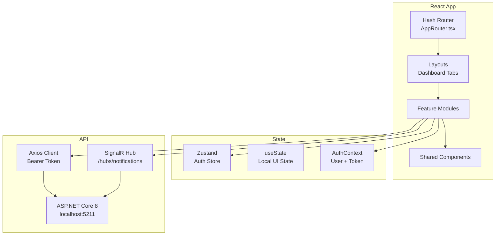
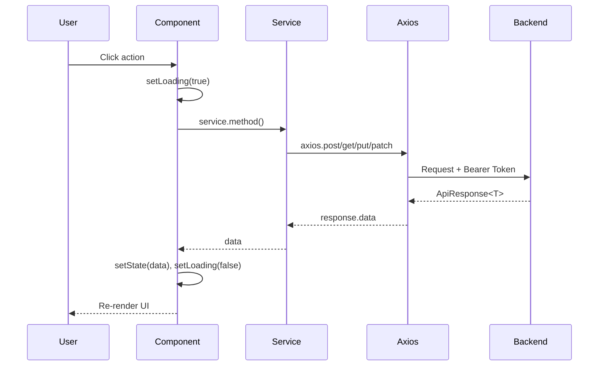

# Frontend Architecture — MANTO EXE

## Overview



**Architecture**: Hash-based routing + Feature-based modules (self-contained)

### Tech Stack

| Tech | Why |
|------|-----|
| React 19 + Vite | Fast HMR, modern React features |
| TypeScript strict | Type safety, better DX |
| Zustand | Auth global state |
| Axios | HTTP client với interceptors |
| SignalR | Real-time notifications |
| Tailwind CSS | Utility-first, consistent design |
| Recharts | KPI/Performance charts |
| Motion/GSAP | Smooth animations |
| Lucide React | Icon library |

---

## Folder Structure

```
src/
├── main.tsx                    # Entry point
├── App.tsx                     # Providers wrapper
├── App.css / index.css         # Global styles
├── router/
│   └── AppRouter.tsx           # Hash-based routing
├── contexts/
│   └── AuthContext.tsx         # Auth state (user, token, isAuthenticated)
├── lib/
│   └── axios.ts                # Axios instance + interceptors
├── components/
│   ├── layout/                 # Header, Footer, Sidebar
│   ├── panels/
│   │   ├── admin/              # Admin tab panels
│   │   ├── employee/           # Employee panels (Survey, TimeTracking)
│   │   └── shared/             # Shared panels
│   └── ui/                     # Button, Input, Modal, Badge
├── features/
│   ├── auth/                   # Login, RoleGate, auth utils
│   ├── dashboard/              # Dashboard panels by role
│   ├── tasks/                  # Task management (create, list, detail)
│   ├── time-tracking/          # Timer, session management
│   ├── survey/                 # Monthly survey
│   └── notifications/          # SignalR real-time notifications
├── pages/
│   ├── auth/                   # Login, ForgotPassword, ResetPassword, GoogleAuthCallback
│   ├── shared/                 # Homepage, ChangePassword, NotAuthorized
│   └── Dashboard.tsx           # Main dashboard with role-based tabs
├── types/                      # Shared TypeScript types (ApiResponse, PagedResult, etc.)
└── assets/                     # Images, icons
```

---

## Routing (Hash-based)

Dự án dùng **hash routing** (`window.location.hash`) thay vì React Router v6/v7.

### Routes

| Hash | Component | Auth Required | Roles |
|------|-----------|---------------|-------|
| `#/` | `Homepage` | ❌ | All |
| `#/login` | `Login` | ❌ | All |
| `#/forgot-password` | `ForgotPassword` | ❌ | All |
| `#/reset-password` | `ResetPassword` | ❌ | All |
| `#/change-password` | `ChangePassword` | ✅ | All |
| `#/survey` | `Survey` | ✅ | All |
| `#/admin/*` | `Dashboard` (tabs) | ✅ | All roles |
| `/auth/callback` | `GoogleAuthCallback` | ❌ | All |

### Dashboard Tabs (trong `#/admin/*`)

| Hash | Tab |
|------|-----|
| `#/admin/user-management` | User Management (Admin) |
| `#/admin/profile` | Profile Settings |
| `#/admin/task/{id}` | Task Detail |
| `#/admin` | Default Dashboard tab |

### Navigation

```tsx
// Navigate bằng hash
window.location.hash = '#/admin/user-management';

// Hoặc check route
const route = window.location.hash; // '#/admin/...'
if (route.startsWith('#/admin')) { ... }
```

---

## Feature Anatomy

### Auth Feature
```
features/auth/
├── RoleGate.tsx                # Permission guard component
└── index.ts
```

### Tasks Feature
```
features/tasks/
├── components/
│   ├── TaskList.tsx
│   ├── TaskCard.tsx
│   ├── TaskDetail.tsx
│   └── CreateTaskModal.tsx
├── hooks/
│   ├── useTasks.ts
│   └── useTaskMutations.ts
├── services/
│   └── task.service.ts
├── types/
│   └── task.types.ts
└── index.ts
```

### Notifications Feature (SignalR)
```
features/notifications/
├── components/
│   └── NotificationBell.tsx
├── hooks/
│   └── useNotifications.ts
├── services/
│   └── notification.hub.ts     # SignalR connection
└── index.ts
```

---

## Data Flow

```
Axios (lib/axios.ts — Bearer auto-attach)
  ↓
[feature].service.ts (API calls)
  ↓
Component / Hook (useState for loading/error)
  ↓
Component.tsx (UI render)
```



---

## State Management

| State Type | Tool | Example |
|------------|------|---------|
| Auth state | AuthContext + Zustand | user, token, isAuthenticated |
| Server data | useState + useEffect | tasks, dashboard data |
| Local UI | useState | modal open, loading, form |
| Real-time | SignalR + useState | notifications |

### Rules

- ✅ Auth/User → AuthContext (cross-feature access)
- ✅ Server data → useState + service calls (không dùng TanStack Query)
- ✅ Local UI → useState (modal, dropdown, form)
- ✅ Real-time → SignalR hooks
- ❌ Không dùng TanStack Query (không có trong project)
- ❌ Không store server data trong Zustand

---

## API Layer

### Axios Instance (`src/lib/axios.ts`)

```ts
// Tự động attach Bearer token từ localStorage
axiosInstance.interceptors.request.use((config) => {
  const token = localStorage.getItem('token');
  if (token) config.headers.Authorization = `Bearer ${token}`;
  return config;
});
```

### Response Format

```typescript
interface ApiResponse<T> {
  succeeded: boolean;
  message: string | null;
  data: T | null;
}

interface PagedResult<T> {
  items: T[];
  totalCount: number;
  pageNumber: number;
  pageSize: number;
  totalPages: number;
  hasPreviousPage: boolean;
  hasNextPage: boolean;
}
```

### Service Pattern

```ts
// services/task.service.ts
export const taskService = {
  getMyTasks: () =>
    axiosInstance.get<ApiResponse<TaskDto[]>>('/api/tasks/my'),
  getById: (id: number) =>
    axiosInstance.get<ApiResponse<TaskDetailDto>>(`/api/tasks/${id}`),
  create: (data: CreateTaskDto) =>
    axiosInstance.post<ApiResponse<TaskDto>>('/api/tasks', data),
  updateStatus: (id: number, status: string) =>
    axiosInstance.patch<ApiResponse<null>>(`/api/tasks/${id}/status`, { status }),
};
```

---

## Role-based Access

### RoleGate Component

```tsx
// features/auth/RoleGate.tsx
<RoleGate
  allowedRoles={['Admin', 'Manager']}
  fallback={<NotAuthorized />}
>
  <AdminPanel />
</RoleGate>
```

### Roles

| Role | Dashboard View | Key Features |
|------|---------------|--------------|
| `Admin` | Full admin panel | User management, org setup, job logs |
| `CEO` | Company dashboard | Company KPI, CEO reports, AI insights |
| `Manager` | Dept dashboard | Task assignment, team performance, manager report |
| `HR` | HR dashboard | HR report, surveys, burnout overview |
| `Employee` | Personal dashboard | My tasks, time tracking, survey, health data |

---

## SignalR Integration

```ts
// notifications/services/notification.hub.ts
import * as signalR from '@microsoft/signalr';

const connection = new signalR.HubConnectionBuilder()
  .withUrl('/hubs/notifications', {
    accessTokenFactory: () => localStorage.getItem('token') ?? '',
  })
  .withAutomaticReconnect()
  .build();

connection.on('ReceiveNotification', (notification) => {
  // Update notification state
});
```

---

## Cross-Feature Communication

| Method | Use Case |
|--------|----------|
| AuthContext | User info, token, role check |
| window.location.hash | Navigation between tabs |
| Props drilling | Parent → Child data |
| Barrel exports | Feature public API |

### Import Rules

```tsx
// ✅ Import từ barrel file
import { RoleGate } from '@/features/auth';

// ✅ Import shared components
import { Button } from '@/components/ui';

// ❌ Không import internal files của feature khác
import { TaskCard } from '@/features/tasks/components/TaskCard'; // WRONG — dùng barrel
```

---

## Shared vs Features

| Shared | Features |
|--------|----------|
| Button, Input, Modal | TaskCard, SurveyForm |
| Header, Footer, Sidebar | Dashboard tabs |
| axios instance | task.service, survey.service |
| ApiResponse, PagedResult | TaskDto, UserDto |
| formatDate, formatMinutes | getEfficiencyLabel |

---

## Backend Modules Summary

| Module | Base Path | Key Endpoints |
|--------|-----------|---------------|
| Auth | `/api/auth` | login, forgot-password, reset-password, google OAuth |
| Users | `/api/users` | me, me/avatar |
| Admin | `/api/admin` | users CRUD, roles, teams, job-logs |
| Departments | `/api/departments` | CRUD |
| Teams | `/api/teams` | CRUD + schedule + overtime |
| Task Types | `/api/task-types` | CRUD + standard-times |
| Tasks | `/api/tasks` | CRUD + bulk + reassign + status |
| Time Tracking | `/api/tasks/{id}/time` | start/pause/resume/stop |
| Performance | `/api/performance` | me, team, department |
| Survey | `/api/survey` | status, submit, history |
| Dashboard | `/api/dashboard` | personal, department, company |
| Burnout | `/api/burnout` | signals, patterns, alerts |
| WorkSchedule | `/api/teams/{id}/schedule` | upsert, delete, overtime |
| Meetings | `/api/meetings` | list, me, create |
| KPI | `/api/kpi` | company, department, trend-analysis |
| Insights | `/api/insights` | department, company latest |
| Reports | `/api/manager-report`, `/api/hr-report`, `/api/ceo-report` | AI-generated |
| Notifications | `/api/notifications` + SignalR `/hubs/notifications` | list, count, mark-read |
| Health | `/api/health` | me trend, me today |